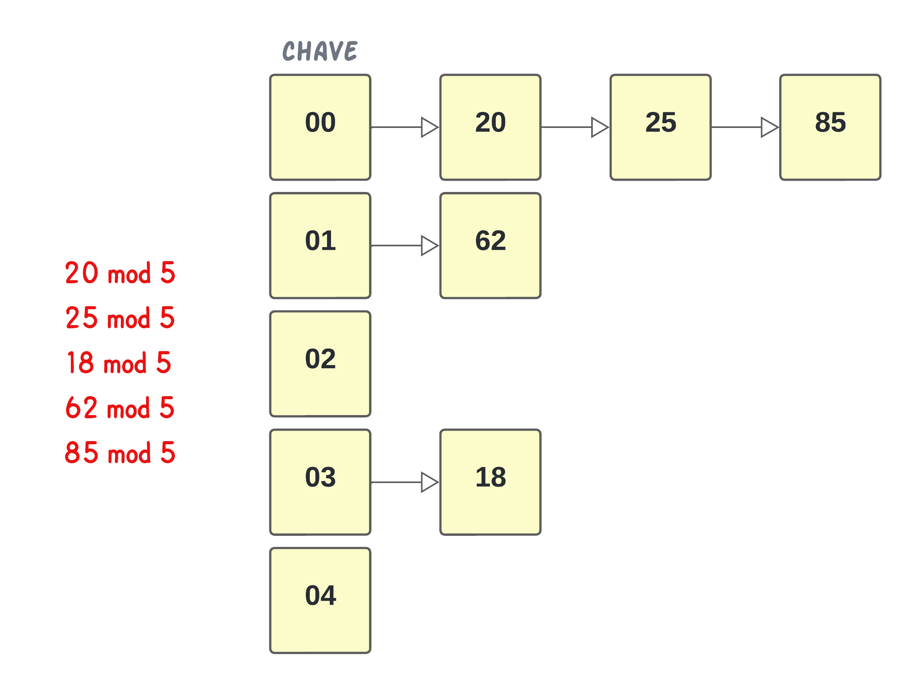
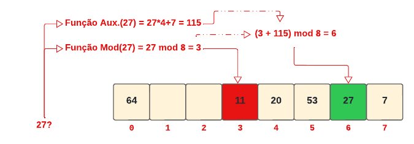
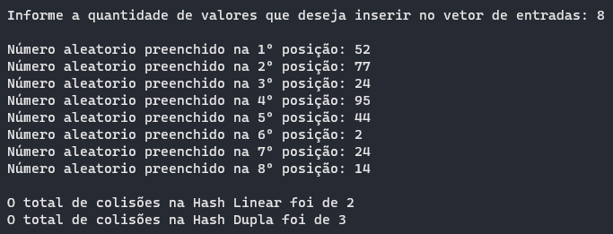
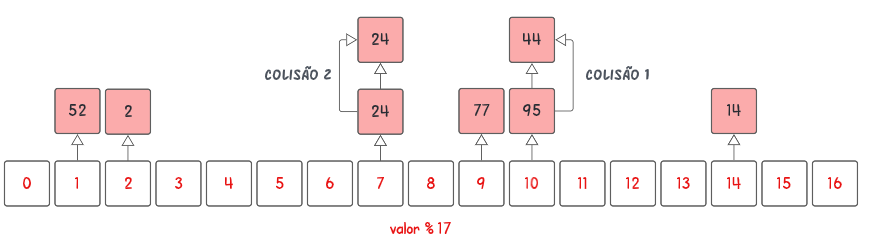
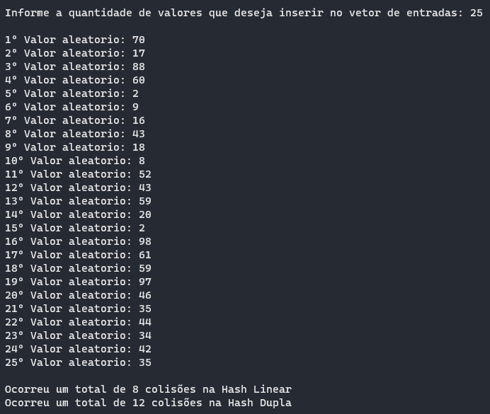

# Trabalho sobre Estrutura de Dados Hash

<h1> Implementação de duas Tabelas Hash

## Conteúdos

 <a href="#apresentação">Apresentação</a> •
 <a href="#representação-gráfica-das-tabelas-hash">Representação gráfica das Tabelas Hash</a> •
 <a href="#lógica">Lógica</a> • 
 <a href="#representação-gráfica">Representação gráfica</a> • 
 <a href="#resultados-e-análises">Resultados e Análises</a> • 
 <a href="#bibliotecas">Bibliotecas</a> •
 <a href="#compilação-e-execução">Compilação e Execução</a> • 
 <a href="#autor">Autor</a>

---

## Apresentação

Foi proposto pelo professor [Michel Pires da Silva](http://lattes.cnpq.br/1449902596670082) durante sua aula de `Laboratório de Algoritmos e Estruturas de Dados 1` um trabalho em que propunha a implementação de dois tipos de tabelas hash sendo elas:

- [X] Hash de Endereçamento Fechado;
- [X] Hash de Endereçamento Aberto por Hash Dupla;

Onde foi obtido exito na implementação das duas tabelas. O trabalho deve receber diretamente no seu código um vetor de no mínimo 20 valores inteiros, os quais serão utilizados como entrada para as duas estruturas que vão ser criadas como o dobro do tamanho do vetor (i.e., número primo maior que esse valor dobro).
O propósito desse trabalho é apresentar e analisar o número de colisões ocorridas para ambas as estruturas quando o mesmo vetor é armazenado, apresentando uma breve discussão dos motivos que levaram uma apresentar melhores resultados.

A estrutura `Hash de Endereçamento Fechado` a busca é feita, pirmieramente, calculando-se o valor da função _hash_ para a chave apresentada como entrada, no algoritmo foi utilizado a função _*mod*_ para encontrar a chave, constitui no método mais simples sendo o resto da divisão entre o valor de inserção e o tamanho da _hash_ devendo ser um número primo. Feito a conversão da chave em uma posição, o dado é encontrado caminhando-se sequencialmente pela `Lista Linear`.

A estrutura `Hash de Endereçamento Aberto por Hash Dupla` consiste no método de procurar a próxima posição vazia após o endereço base da chave colidir, e essa busca é feita através de uma outra função auxiliar em que pega o valor de inserção, multiplica pela posição do ultimo conflito e soma com tamanho da _hash_, após essa operação é feito um mod com a soma das funções utilizadas e o tamanho da hash, onde então é encontrado uma nova posição não havendo incrementos em 1 a cada interação.

---

## Representação gráfica das Tabelas Hash

Segue o exemplo de uma estrutura `Hash de Endereçamento Fechado` onde é dado uma tabela de tamanho 5 cuja estrutura irá armazenar os seguintes valores nas chaves: 20, 25, 18, 62 e 85 

 

Segue o exemplo de uma estrutura `Hash de Endereçamento Aberto por Hash Dupla` onde é feita a tentativa de inserção do valor _27_ em sua chave mas é encontrado o conflito, demonstrando a utilização e aplicação das funções

 

---

## Lógica

Ao se deparar com proposta do trabalho citado na <a href="#apresentação">Apresentação</a> foi decidido utilizar uma [Lista Linear](https://github.com/mpiress/linear_list) clonada do respectivo repositorio disponibilizado pelo professor para o inicio da resolução onde era primeiramente é introduzido a quantidade de valores para a alocação dinâmica, usando a função *malloc*, do vetor _input_vector_ para tornar possível a inserção dos valores aleatorios até 100 utilizando a função *rand* nesse vetor, com isso então era feito a chamada da primeira função, _*FoldSize*_ onde pega a quantidade de valores inseridos e transforma essa qauntidade e transforma no proximo número primo do seu dobro, determinando então o tamanho das `Tabelas Hash`, retornando um inteiro onde é passado como parâmetro para a primeira função de implementação da _hash_, sendo ela, _*LinearHashing*_ onde inicia com um vetor de `Lista Linear` sendo a _LinearHashing[hashsize]_ e com isso é iniciado o processo através de uma laço de repetição `FOR` que vai repetir conforme a quantidade de valores no vetor de entradas e a cada repetição vai ser calculado o *mod* entre o valor inserido e o tamanho da hash retornando a chave, com isso vai ser feita a verificação em uma estrutura de decisão `IF` se a primeira posição da _*LinearHashing*_ é igual a ultima posição, ou seja, se aquela _hash_ está vazia, caso esteja vazia é apenas inserido aquele valor na posição que corresponde a chave, caso não esteja vazia significa que houve uma colisão, registrando então essa colisão na variavel <i>colision_count</i> e adicionando na posição mesmo assim.
A função prosseguida da citada acima, _*DoubleHashing*_ funciona da mesma forma que a _*LinearHashing*_ até ser encontrado uma colisão, onde a mesma é contabilizada também na variavel <i>colision_count</i> e após isso é chamada a segunda função que faz a procura de outra posição essa função consiste em: $$Func.Aux.(Valor) = (Valor*PosicaoConflito)+TamanhoHash$$ e após isso é feito um mod com a soma dessa função com a primeira função mod e o tamanho da hash, onde vai retornar uma nova posição como no <a href="#autor">exemplo gráfico</a> acima e apenas se for encontrado uma nova colisão que será colocado um valor em chave repetida.
As duas funções de implementação das `Tabelas Hash` retornam seus números de colisões ocorridos durante o processo, com isso é possível ser feita a comparação ao final do programa de qual `Tabela Hash` ocorre o maior número de colisões, sendo possível ver esse resultado no tópico  <a href="#resultados-e-análises">Resultados e Análises</a>.

---

## Representação gráfica

Segue a representação gráfica de saída do programa, onde é possível verificar a quantidade de colisões em cada tipo de _hash_ e a inserção de valores para ocorrer esse processo
 
 • *Representação feita com a quantidade de valores pequena para melhor representatividade gráfica e melhor entedimento do processo, simplificando a representação*

 

As representações abaixo demonstram como seria uma possível hash com os valores acima e suas colisões:

 
<i><b>Imagem 1: </b>Representação da Hash Linear com os valores da representação acima</i>

 
<i><b>Imagem 2: </b>Representação da Hash Dupla com os valores da representação acima</i>

---

## Resultados e Análises 

Segue a representação gráfica de saída do programa, onde é possível verificar a quantidade de colisões em cada tipo de _hash_ comparando suas colisões

 

Ao visualizar o resultado na primeira representação acima do dois tipos de `Tabelas Hash` onde foi visto que a _*Hash Linear*_ obteve um total de 2 colisões e a _*Hash Dupla*_ obteve 3, conclui que a _*Hash Dupla*_ obteve um número maior de colisões em 100% dos testes feitos com o programa desenvolvido, vendo que ao ser chamada a função auxiliar na maioria das vezes retornava uma chave que já estava ocupada, ocasionando em uma outra colisão mas levando em vantagem que era espalhado melhor as chaves pelos endereços disponíveis não criando uma tabela com chaves com muitos valores

---

## Bibliotecas

Para o funcionamento do programa, é necessário incluir as seguintes bibliotecas: 
<ul>
    <li><code>#include 'stdlib.h'</code></li>
    <li><code>#include 'stdio.h'</code></li>
    <li><code>#include 'time.h'</code></li>
    <li><code>#include 'stdbool.h'</code></li>
</ul>

---

## Compilação e Execução

O programa feito de acordo com a proposta possui um arquivo Makefile que realiza todo o procedimento de compilação e execução. Para tanto, temos as seguintes diretrizes de execução:

| Comando                |  Função                                                                                           |                     
| -----------------------| ------------------------------------------------------------------------------------------------- |
|  `make clean`          | Apaga a última compilação realizada contida na pasta build                                        |
|  `make`                | Executa a compilação do programa utilizando o gcc, e o resultado vai para a pasta build           |
|  `make run`            | Executa o programa da pasta build após a realização da compilação             

---

## Autores

Desenvolvido por [Pedro Henrique Louback Campos](https://github.com/PedroLouback) 

Aluno do 3° periodo de `Engenharia da Computação` no [CEFET-MG](https://www.cefetmg.br)
